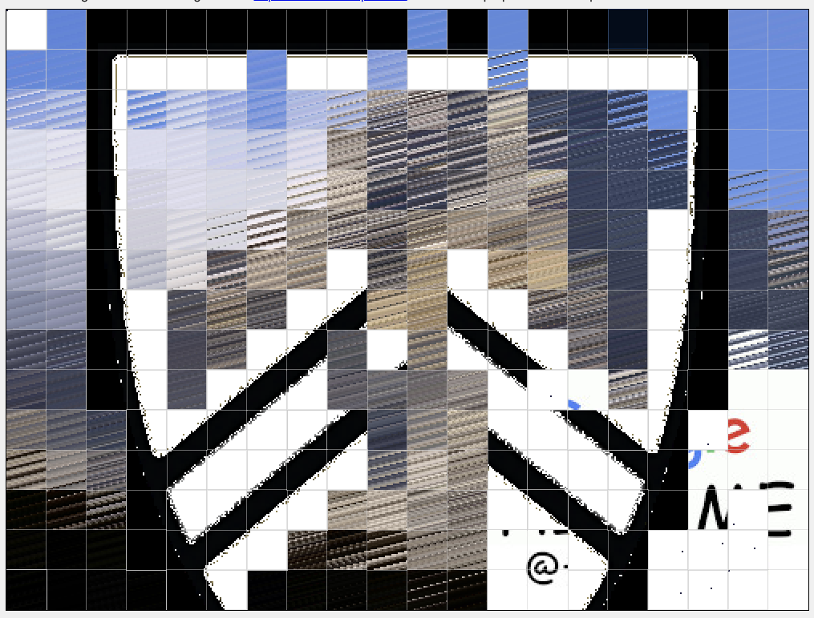
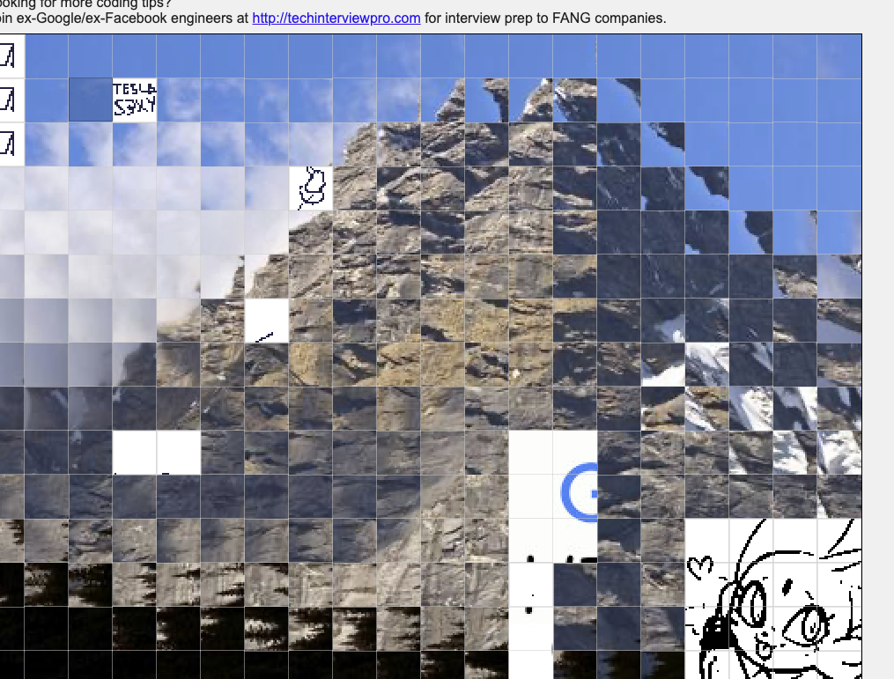
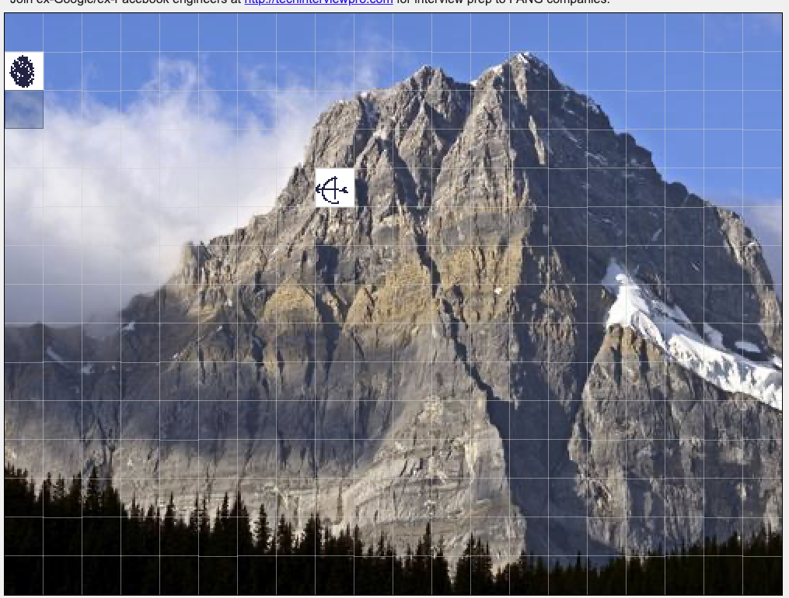

# how to use

clone the repo, cd into it, and then you can run these commands:

**draw image (you can replace image.png (needs to be 500x375, idk what will happen if it isnt))**
```bash
php make_image.php
```

**make board empty**
```bash
php make_empty.php
```

# attempts

## first try:


## second try:


## third attempt (not sure why it works though):

